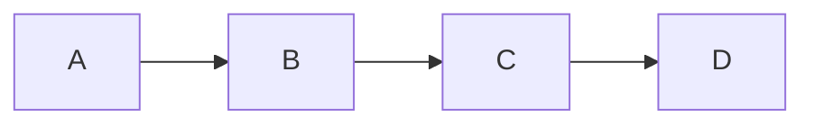

# Taiyaki

<p>&nbsp;</p>
<p align="center">
  
</p>

# Language implementation

# Compilation strategy

After parsing, type checking, and other preliminary steps, the compiler
proceeds through a series of transformations applied to the syntax tree. The
final goal of this process is to arrive at an adaptation of the input,
semantically identical, but based on a much smaller expression grammar.
Compared to the source language, this representation is more suitable for code
generation and evaluation. The code generation stage is important enough that
we treat this grammar as its own language entirely. There are a number of
benefits of doing so:

- Less cognitive overhead



#### Normalize lambda abstractions

##### Expansion of multiple arguments

```
(x, y, z) ⇒ e
```

```
lam(x) ⇒
  lam(y) ⇒
    lam(z) ⇒
      e
```

##### Pattern elimination

```
(P[...]) ⇒ e
```

```
lam($v) ⇒
  match $v {
    P[...] ⇒ e
  }
```

#### Translate let-bindings

Let-bindings are still permitted in our intermediate language, but only those
that bind to a variable, that is, are of the form `let v = expr`, where `v` is
a variable.

##### Simple lets

```
let v = expr
```

```
fix v = expr
```

##### Function bindings

```
let f(x, y) = expr
```

```
fix f =
  lam(x) ⇒
    lam(y) ⇒
      expr
```

##### Pattern bindings

```
let P[...] = expr in body
```

```
match expr {
  | P[...] ⇒ body
}
```

#### Translate `match` expressions to simple `case` pattern matching

TODO

#### Desugar tuples, records, and list literals

##### List literals

```
[1, 2, 3]
```

```
1 :: 2 :: 3 :: []
```

```
((::) 1 ((::) 2 ((::) 3 [])))
```

##### Tuples

```
('a', 1)
```

```
(,) 'a' 1
```

##### Records

```
{ foo = "baz", bar = 1 }
```

```
#Record ({foo} "baz" ({bar} 1 {}))
```

#### Transform type class constraints to records

TODO

## Patterns

##### Literal patterns

```
  | 5 => true
```

```
  | $a when $a == 5 => true
```

```
  | [1, 2, 3] => true
```

```
  | [$a, $b, $c]
      when $a == 1 && $b == 2 && $c == 3 =>
        true
```

##### Or-patterns

```
  | [x, _] or [x, _, _] => true
```

```
  | [x, _]    => true
  | [x, _, _] => true
```

##### As-patterns

```
  match foo() {
    | [x, _, _] as xs => e1
    | _               => e2
  }
```

```
  match foo() {
    | xs =>
        match xs {
          | [x, _, _] => e1
          | _         => e2
        }
    | _ => e2  -- (*)
  }
```

The final clause (*) here is redundant, but this is not generally true.
As a counter-example, consider for instance:

```
  match foo() {
    | ([x, _, _] as xs, []) => e1
    | _                     => e2
  }
```

```
  match foo() {
    | (xs, []) =>
        match xs {
          | [x, _, _] => e1
          | _         => e2  -- (a)
        }
    | _ => e2  -- (b)
  }
```

Note that both (a) and (b) are needed here. Of course, there can also be more
than one alias in a clause:

```
  match foo() {
    | [(1 :: _) as xs, (2 :: _) as ys, (3 :: _) as zs] => e1
    | _                                                => e2
  }
```

These can all be bundled up neatly into a tuple:

```
  match foo() {
    | [xs, ys, zs] =>
        match (xs, ys, zs) {
          | (1 :: _, 2 :: _, 3 :: _) => e1
          | _                        => e2
        }
    | _ => e2
  }
```

<!--

```
  match ys {
    | ((1 :: 2 :: _) as xs, (1 :: 2 :: _) as ys) => xs <> ys
    | _ => e2
  }
```

```
  match ys {
    | (xs , ys) =>
        match (xs, ys) {
          | (1 :: 2 :: _, 1 :: 2 :: _) => xs <> ys
          | _                          => e2
        }
    | _ => e2
  }
```

```
  match ys {
    | (xs , ys) =>
        match xs {
          | 1 :: 2 :: _ =>
              match ys {
                | 1 :: 2 :: _ => xs <> ys
                | _           => e2
              }
          | _ => e2
        }
  }
```

-->

##### Any-patterns

```
  | _ => true
```

```
  | $_ => true
```

### Exhaustiveness checking

### Compilation

# Etymology

Taiyaki (鯛焼き) is a Japanese fish-shaped cake, commonly sold as street food.

## Attribution

<small>
  <a href="https://www.flaticon.com/free-icons/taiyaki" title="taiyaki icons">Taiyaki icons created by Freepik - Flaticon</a>
</small>
